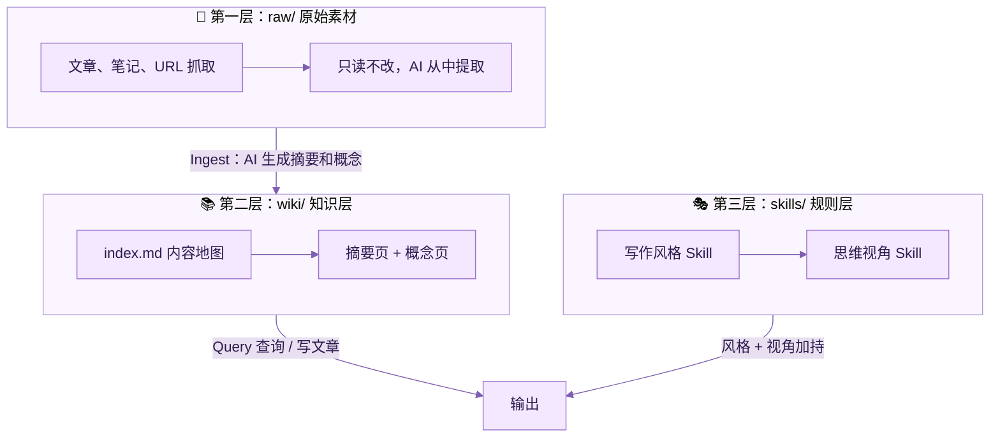

# LLM Wiki 写作知识库 · 模板仓库

一个基于 [Karpathy LLM Wiki](https://gist.github.com/karpathy/442a6bf555914893e9891c11519de94f) 模式的写作知识库。用任何 AI Agent 打开这个目录，它就知道怎么干活。

**传统 AI 对话是一次性的** — 问完关窗口，什么都没留下。LLM Wiki 不一样：AI 把有价值的内容写回知识库，下次再问它已经知道了。用得越多，越懂你。

## 架构



## 两种使用方式

| 方式 | 说明 | 适合谁 |
|------|------|--------|
| 🖥️ 本地 AI Agent | 用 Claude Code / Cursor / Gemini 等打开目录 | 在电脑前写作 |
| 📱 聊天消息驱动 | 配合 [msgflow](https://github.com/ohwiki/msgflow) 自动化 | 手机发消息就能用 |

## 快速开始

### 方式一：本地 AI Agent

1. 用模板创建你自己的仓库（点 GitHub 的 "Use this template"）
2. 用你的 AI 工具打开目录

| 工具 | 自动读取 |
|------|---------|
| Claude Code | `CLAUDE.md` → `AGENTS.md` |
| Cursor | `.cursorrules` → `AGENTS.md` |
| Gemini CLI | `GEMINI.md` → `AGENTS.md` |
| 其他 | 手动说「请读 AGENTS.md」 |

3. 开始使用：

```
摄入 raw/ 下的新文章          # Ingest
我以前写过什么关于 AI 记忆的？  # Query
请做一次 wiki 健康检查         # Lint
```

### 方式二：配合 msgflow（聊天自动化）

部署 [msgflow](https://github.com/ohwiki/msgflow) 后，在 Admin 页面填入本仓库地址和 Token，即可通过飞书/Telegram/企业微信发消息操作知识库：

```
摄入 https://mp.weixin.qq.com/s/xxx    # 自动抓取 → 存入 raw/ → 生成 wiki
查询 AI Agent 的记忆机制有哪些方案？     # 基于 wiki 回答
改写 鲁迅 https://example.com/article   # 用 Skill 风格改写
蒸馏 费曼                               # 生成费曼思维 Skill
```

## 三个核心操作

| 操作 | 做什么 | 影响范围 |
|------|--------|---------|
| **Ingest（摄入）** | 新素材放入 `raw/`，AI 生成摘要和概念页 | 更新 index.md + 生成相关页面 |
| **Query（查询）** | 对 wiki 提问或写文章，好回答写回 wiki | 知识持续复利 |
| **Lint（健康检查）** | 检查断链、孤立页面、过期内容 | 保持 wiki 健康 |

## 目录结构

```
├── AGENTS.md                    ← 核心操作手册（所有 Agent 的规则）
├── CLAUDE.md / GEMINI.md / ...  ← 各工具入口（指向 AGENTS.md）
│
├── raw/                         ← 第一层：原始素材（只读）
│   └── （你的文章放这里）
│
├── wiki/                        ← 第二层：知识层（AI 维护）
│   ├── index.md                 ← 内容地图
│   └── log.md                   ← 操作日志
│
└── .agents/skills/              ← 第三层：规则层（Skill）
    ├── ma-sanli-writer/         ← 马三立风格写作
    ├── ma-sanli-perspective/    ← 马三立视角
    ├── lu-xun-writer/           ← 鲁迅风格写作
    ├── lu-xun-perspective/      ← 鲁迅视角
    ├── xu-zhimo-writer/         ← 徐志摩风格写作
    ├── xu-zhimo-perspective/    ← 徐志摩视角
    └── nuwa-skill/              ← 女娲（蒸馏任何人的思维方式）
```

## 预装 Skill

| Skill | 用途 | 触发方式 |
|-------|------|---------|
| **ma-sanli-writer** | 马三立蔫哏风格写文章 | 「用马三立风格写」 |
| **ma-sanli-perspective** | 马三立心智模型分析 | 「用马三立的视角看看」 |
| **lu-xun-writer** | 鲁迅匕首投枪式杂文 | 「用鲁迅风格写」 |
| **lu-xun-perspective** | 鲁迅心智模型分析 | 「用鲁迅的视角看看」 |
| **xu-zhimo-writer** | 徐志摩诗意风格写文章 | 「用徐志摩风格写」 |
| **xu-zhimo-perspective** | 徐志摩心智模型分析 | 「用徐志摩的视角看看」 |
| **nuwa-skill** | 蒸馏任何人的思维方式 | 「蒸馏一个 XXX」 |

蒸馏完的人物 Skill 自动出现在 `.agents/skills/` 下，可以直接调用：

```
用芒格的视角帮我分析这个投资决策
```

## 改成你自己的

1. **放入素材** — 把你的文章、笔记放入 `raw/`，让 AI ingest
2. **蒸馏你需要的人物** — 用女娲蒸馏对你有用的思维框架
3. **换写作 Skill** — 不喜欢预装的风格？删掉换成你自己的
4. **持续迭代** — 每写一篇新文章 file back 回 wiki，系统越用越懂你

## 设计原则

- **AGENTS.md 是唯一规则文件** — 其他入口文件都是两行指针，改规则只改一处
- **raw/ 只读不改** — 原始素材是事实来源，AI 永远不修改
- **wiki/ 由 AI 维护** — 你读它，AI 写它
- **Skill 只读不改** — AI 不会自己改 Skill，改进建议写在 wiki 里由你决定
- **file back 是核心** — 每次有价值的回答都写回 wiki，知识才能复利

## 致谢

- [Karpathy LLM Wiki](https://gist.github.com/karpathy/442a6bf555914893e9891c11519de94f) — 三层架构和三操作模型的原始设计
- [女娲 Skill](https://github.com/alchaincyf/nuwa-skill) by [花叔](https://x.com/AlchainHust) — 人物思维蒸馏方法论
- [AGENTS.md 规范](https://agents.md) — 跨 Agent 配置文件标准
- [msgflow](https://github.com/ohwiki/msgflow) — 消息驱动的自动化执行引擎

## License

MIT
